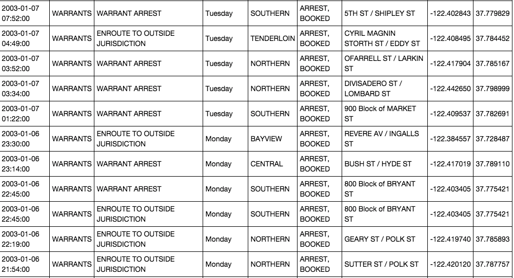

### Kaggle kernel study

# San Francisco Crime Classification

## 1. 개요

## Predict the category of crimes that occurred in the city by the bay

https://www.kaggle.com/c/sf-crime/overview

## 2. Data

This dataset contains incidents derived from SFPD Crime Incident Reporting system. The data ranges from 1/1/2003 to 5/13/2015. The training set and test set rotate every week, meaning week 1,3,5,7... belong to test set, week 2,4,6,8 belong to training set. 

### Data fields

- **Dates** - timestamp of the crime incident
- **Category** - category of the crime incident (only in train.csv). **This is the target variable you are going to predict.**
- **Descript** - detailed description of the crime incident (only in train.csv)
- **DayOfWeek** - the day of the week
- **PdDistrict** - name of the Police Department District
- **Resolution** - how the crime incident was resolved (only in train.csv)
- **Address** - the approximate street address of the crime incident 
- **X** - Longitude
- **Y** - Latitude

## 3. Evaluation(평가)

RMSE

## 4. Preprocessing (데이터 전처리)

## 5. Result (결과)

